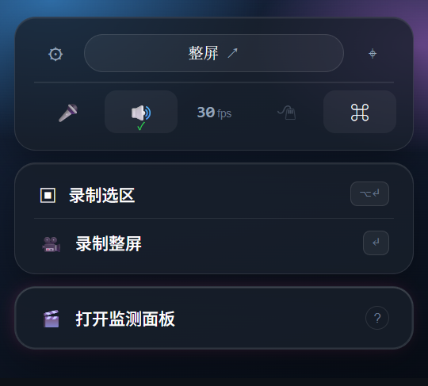
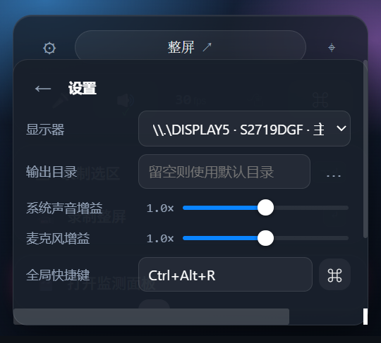
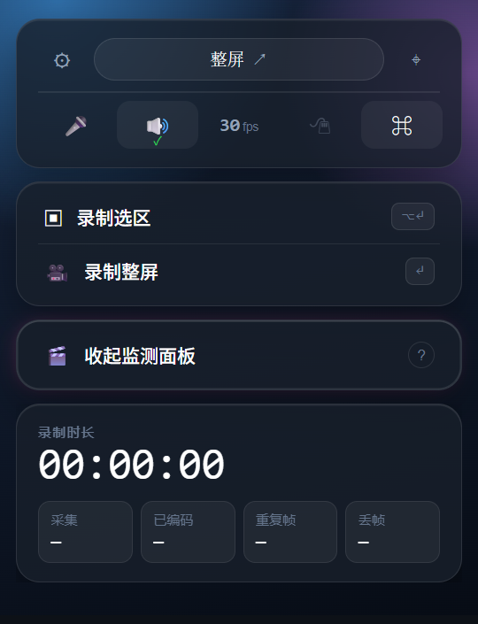
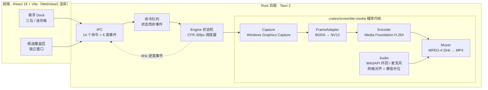

<div align="center">



# ScreenLite

**Windows 11 上的悬浮录屏 Dock —— 原生采集，零 FFmpeg，一个 exe 就是整个程序。**


</div>

---

> **English TL;DR** — ScreenLite is a minimal floating screen recorder for Windows 11.
> It captures with **Windows Graphics Capture**, encodes **H.264 + AAC** through **Media Foundation**,
> and muxes MP4 natively — **no FFmpeg anywhere in the pipeline**. The whole program ships as
> **one self-contained `.exe`** (frontend embedded). Region capture, system-audio + microphone
> dual-source recording, floating always-on-top Dock, hotkey and tray control.

---

## 为什么值得用它

Windows 上的录屏工具大多把 FFmpeg 一起打包（体积大、许可复杂），或者依赖 Electron / 浏览器内核。
ScreenLite 只用 Windows 自己的原生接口。

| | |
|---|---|
| **零 FFmpeg** | 采集用 Windows Graphics Capture，编码用 Media Foundation（H.264 + AAC），封装用 MPEG-4 Sink。全链路不引入 FFmpeg / libx264 / libx265 |
| **一个 exe 就是整个程序** | 前端已内嵌进二进制；`bundle` 不声明任何 `resources` / `externalBin`；安装包里写进安装目录的**只有一个文件** |
| **无 Electron / CEF 依赖** | 界面由 Tauri 2 + WebView2 渲染，媒体链路全在 Rust 侧的原生线程上 |
| **悬浮 Dock 形态** | 无边框 + 透明 + 置顶的三块玻璃岛，不占屏幕；录制时自动最小化，不会把自己的界面录进去 |
| **双路音频** | 系统声音（WASAPI 环回）与麦克风可同时录，带音频网格对齐与静音补位，音频异常不会拖住视频编码 |

### 实测数据

| 场景 | 结果 |
|---|---|
| 单源 30 分钟连续录制（系统声音 + 整屏） | 时长 1800593 ms · **丢帧 0** · 音视频漂移 **−7 ms** |
| 双源 30 分钟连续录制（系统声音 + 麦克风） | 180050 个音频块（90026 + 90024）· **补位块 0** · 漂移 **−12 ms** |
| 安装包体积 | **2.24 MB**（NSIS 单文件安装器，装完目录里只有一个 `screenlite.exe`） |

数字取自运行日志的停止汇总与每源明细行。

---

## 界面

<div align="center">

| 空闲：三块悬浮岛 | 设置：贴齿轮弹出的面板 | 遥测：向下展开的真实指标 |
|:--:|:--:|:--:|
|  |  |  |

</div>

界面要点：

- **三块独立的岛**：`⚙ / 尺寸胶囊 / 框选` · `录制选区 / 录制整屏` · `打开监测面板`；岛间距 10px，岛内留白 12–18px
- **玻璃质感**：`rgba(24,31,43,0.8)` 底色 + 顶部内高光 + 柔影
- **展开类面板脱离文档流**：设置是贴着齿轮算锚点弹出的面板，遥测是从第三块岛**向下长**（窗口跟着变高，顶部不动）
- **永远没有系统外框**：无标题栏、无系统描边、无阴影残留

---

## 快速开始

### 方式一：装安装包

从本仓库的 **Releases** 下载 `ScreenLite_<版本>_x64-setup.exe`，双击即可。
装完安装目录里只有一个 `screenlite.exe`；卸载走系统「应用和功能」。

### 方式二：从源码构建

```powershell
# 需要：Rust 1.77+ / Node 20+ / WebView2（Windows 11 自带）
git clone https://github.com/D-OneXXX/ScreenLite.git
cd ScreenLite
npm install

npm run build                  # 前端类型检查 + 打包（tsc --noEmit && vite build）
npx tauri build --bundles nsis # 出单一 exe 安装包
# 产物：target\release\bundle\nsis\ScreenLite_<版本>_x64-setup.exe

# 只要免安装的绿色版（前端已内嵌，可直接运行）：
npx tauri build --no-bundle
# 产物：target\release\screenlite.exe
```

> **不要**直接用 `cargo build --release`：那不会内嵌前端，程序会去连开发服务器，打开是白屏。
> 生产构建必须走 `tauri build`。

### 怎么用

| 操作 | 方式 |
|---|---|
| 录整屏 | 点 `🎥 录制整屏`，或按 `Enter` |
| 录一块区域 | 点 `⌖` 框选（**在目标窗口上点一下会自动吸附**成整窗）→ 再点 `▣ 录制选区`（或 `Alt+Enter`） |
| 开始 / 停止 | 界面按钮 / `Ctrl+Alt+R` / 托盘菜单，三条入口走同一条命令队列 |
| 显示 / 隐藏 Dock | `Alt+Shift+S`，或托盘图标左键 |
| 看指标 | `🎬 打开监测面板`：录制时长、采集 / 已编码 / 重复帧 / 丢帧、每路音频峰值 |

产物默认落在 `C:\Users\<用户名>\Videos\ScreenLite\`；录制中是 `.mp4.partial`，正常停止后改名 `.mp4`。
若看到残留的 `.partial`，说明那次录制没有走完收尾（例如被强杀），文件不可用 —— 重录一次即可。

---

## 架构



**数据边界**：视频帧**从不进入 JavaScript**。前端只收发 JSON 配置与状态；
捕获、转换、编码、封装全部发生在同一个专用媒体线程上（`std::thread`，非 tokio）。

---

## 工程说明（几条容易踩的硬约束）

- **透明窗口里不要用 `backdrop-filter`**：它会强制新建一个离屏合成层，把整个窗口矩形渲染成半透明面、
  边缘带色偏细线。玻璃质感由"底色 + 顶部内高光 + 柔影"三件套承担即可。
- **无边框有三个独立来源，缺一就会复发**：① 上游框架（tao）会在窗口生命周期事件里重放窗口样式，
  把标题栏位加回来 → 用 `WM_STYLECHANGING` 子类把写回路径挡死；② 上游为无边框窗口预留的**阴影区**
  会把窗口加大一圈、客户区缩小一圈，禁用 DWM 渲染后那圈由 GDI 画成一条浅色边框 → 在配置里关掉阴影
  （`"shadow": false`）；③ DWM 自身的非客户区渲染与系统强调色边框 → 用 DWM 属性关掉。
  三者都有回归测试或日志可核对。
- **展开类面板不要用"改窗口尺寸"来实现**：频繁改尺寸会反复触发窗口样式重放；设置面板做成
  文档内的浮层，遥测做成"从岛向下长 + 窗口跟着变高"，两者互不牵连。
- **窗口高度按内容测量，不写死**：临时摘掉 `min-height`，量 `getBoundingClientRect().height`，再 `setSize`。
  展开动画只能用 `clip-path` —— `max-height` 会改变布局高度，量到动画中间态窗口尺寸就错了。

---

## 已知限制

- **仅 Windows 11**（依赖 WGC + Media Foundation；需要 WebView2 运行时，Win11 自带）
- **单显示器**：一次录一个显示器；区域录制仍**先整屏取帧再裁剪**（GPU 裁剪在路线图上）
- **分辨率上限**：长边 ≤ 2560 且高 ≤ 1600（区域录制也绕不过，因为采集永远先取整屏）
- **单次时长 ≤ 2 小时**；磁盘低于阈值会主动停止并**保存文件**
- **开始录制后 Dock 会自动最小化**（避免把自己的界面录进画面），停止时自动恢复
- 暂停 / 继续尚未实现

---

## 许可

[MIT](LICENSE) · 未集成 FFmpeg / x264 / x265 等第三方编码二进制。
但个人免费使用不等于没有许可义务：Windows 原生接口与 H.264/AAC 本身仍可能涉及各自的系统许可条件。
